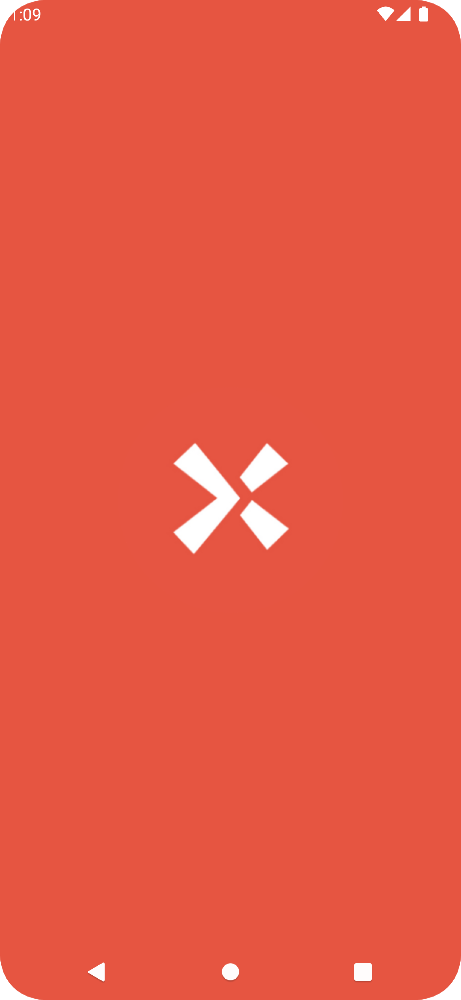
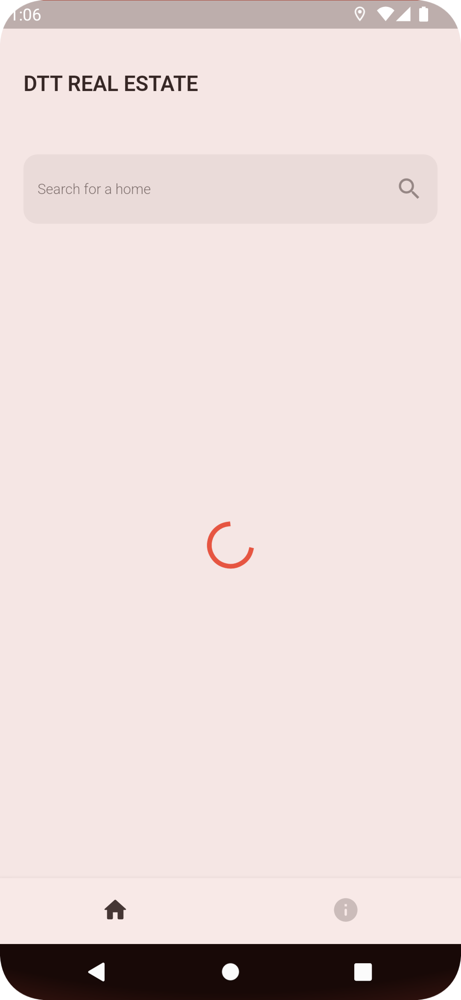
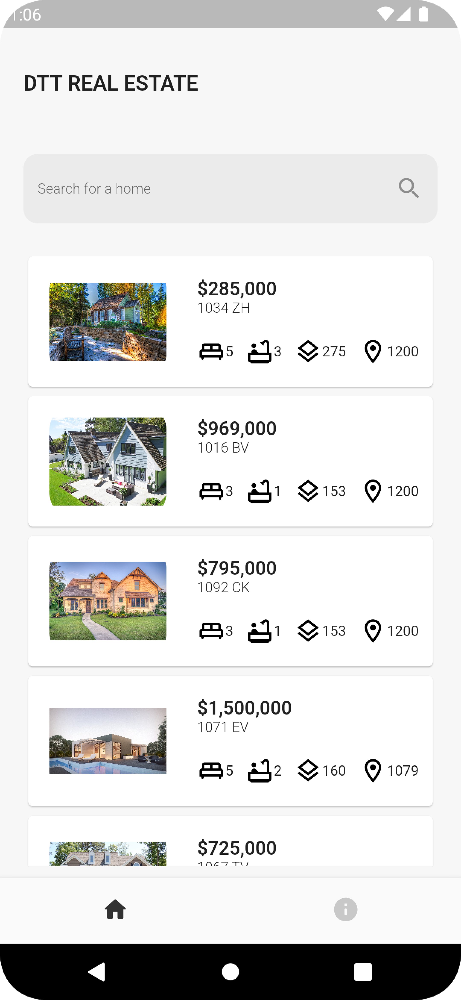
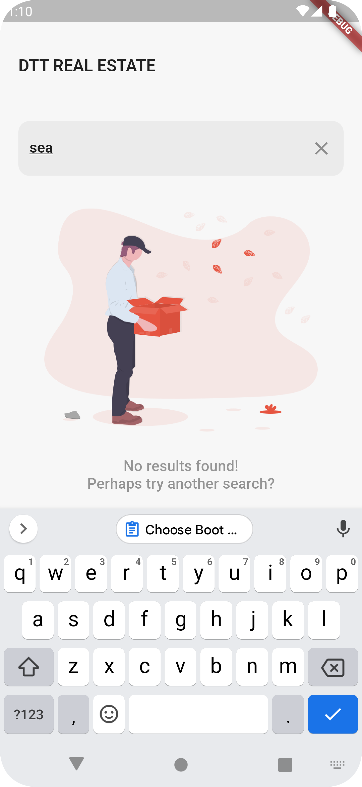
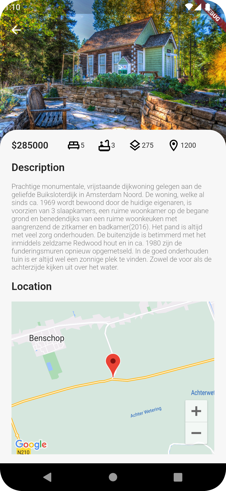
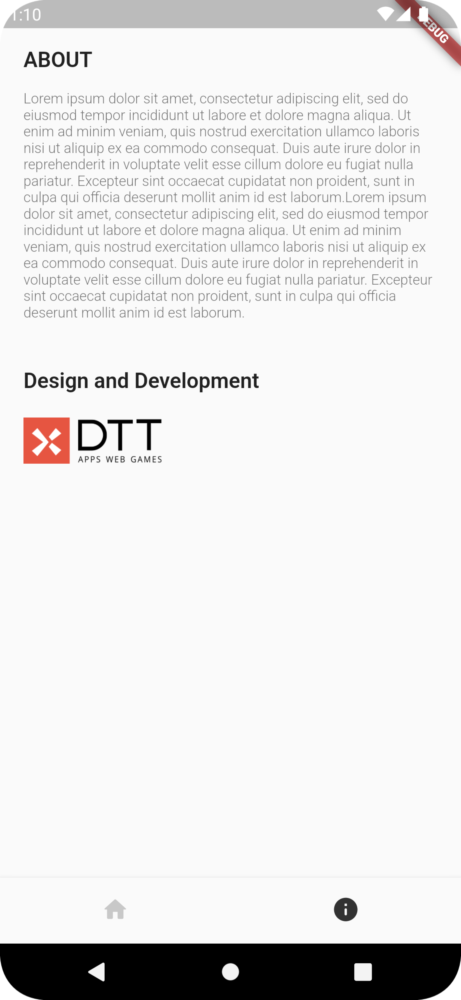

# Flutter Sample Project
This app create as test project for DTT.
This app will work on Android and iOS.

To run app for test you can use [Test APK](https://github.com/SediqeZangane/flutter_dtt/blob/master/app-release.apk)

## Technologies used
* Developed by Clean Architecture
* Flutter Bloc as State Manager
* Dio for http request
* Geolocator for getting house distances
* Google Maps for showing house
* flutter Native splash for app splash

